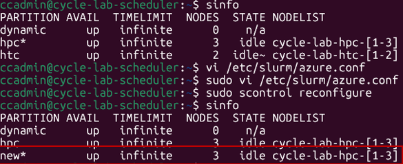
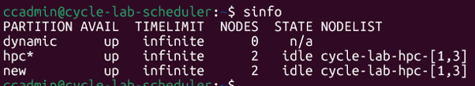
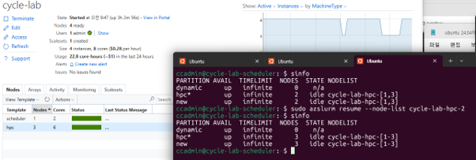
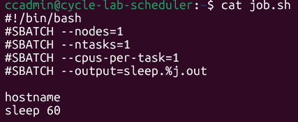
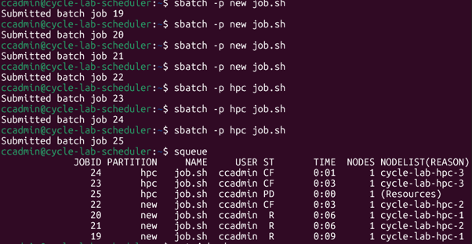

# 기존 클러스터에 새 파티션 추가

사용 중인 파티션의 노드를 공유하여 새로운 파티션을 추가

## 1. 파티션 설정

스케줄러 노드에서 `azure.conf` 파일을 수정한다.

```bash
sudo vi /etc/slurm/azure.conf
```

기존 HPC 파티션 설정을 복사한 뒤, `PartitionName`만 변경하여 추가한다.

```ini
# 기존 파티션
PartitionName=hpc Nodes=cycle-lab-hpc-[1-3] Default=YES DefMemPerCPU=1536 MaxTime=INFINITE State=UP
Nodename=cycle-lab-hpc-[1-3] Feature=cloud STATE=CLOUD CPUs=2 ThreadsPerCore=1 RealMemory=3072

# 추가할 파티션 (PartitionName만 변경)
PartitionName=new Nodes=cycle-lab-hpc-[1-3] Default=YES DefMemPerCPU=1536 MaxTime=INFINITE State=UP
```

설정 반영:

```bash
sudo scontrol reconfigure
```

적용 예시:

```ini
# /etc/slurm/azure.conf

# 기존 hpc 파티션
PartitionName=hpc Nodes=cycle-lab-hpc-[1-3] Default=YES DefMemPerCPU=1536 MaxTime=INFINITE State=UP
Nodename=cycle-lab-hpc-[1-3] Feature=cloud STATE=CLOUD CPUs=2 ThreadsPerCore=1 RealMemory=3072

# 기존 htc 파티션 (주석 처리됨)
#PartitionName=htc Nodes=cycle-lab-htc-[1-2] Default=NO DefMemPerCPU=1536 MaxTime=INFINITE State=UP
#Nodename=cycle-lab-htc-[1-2] Feature=cloud STATE=CLOUD CPUs=2 ThreadsPerCore=1 RealMemory=3072

# 추가한 new 파티션 (hpc 노드를 공유)
PartitionName=new Nodes=cycle-lab-hpc-[1-3] Default=YES DefMemPerCPU=1536 MaxTime=INFINITE State=UP
```



## 2. 단일 노드 제거 및 생성 시 동작 확인

cycle-lab-hpc 노드 3대 중 1대를 제거한 뒤, 다시 resume하여 정상 동작을 확인한다.



노드 1대 resume 및 정상 확인:



## 3. 파티션별 Job 실행

파티션은 나뉘었으나 물리 VM은 공유하기 때문에, 물리 자원의 제약을 받는다.

예: 2 core VM 3대 환경에서 `--cpus-per-task=1`로 Job 실행 시, 최대 6개 Job만 동시 수행 가능하다.



Job을 7번 수행하면 6개가 동작하고, 1개는 대기한다.



## 4. 주의사항

클러스터를 Terminate 후 Start하거나, 아래 명령어를 수행하면 **GUI 설정으로 되돌아가므로** 수동 추가한 파티션이 사라진다.

```bash
azslurm partition
azslurm scale
```


