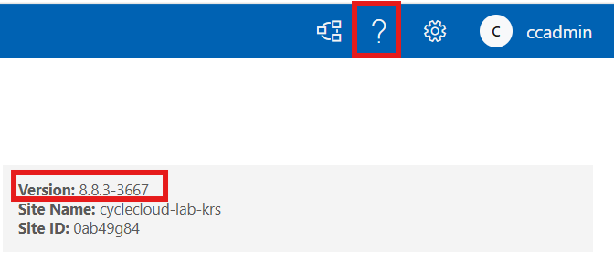

# 버전 정보 확인

CycleCloud와 Slurm 버전 정보 확인 방법

###### CycleCloud 버전 확인

CycleCloud UI > 우측 상단의 `?` 클릭



###### Slurm 버전 확인

Cyclecloud UI > 클러스터 > Edit > Advanced Settings > Slurm Version 확인


###### Slurm Jetpack 버전 확인

스케줄러 노드에서 아래 명령어를 실행한다.

```bash
sudo jetpack config cyclecloud.cluster_init_specs --json | egrep 'project"|version'
```

출력 예시:

```json
"project": "slurm",
"version": "3.0.12"
"project": "slurm",
"version": "3.0.12"
```
