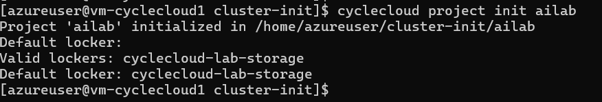
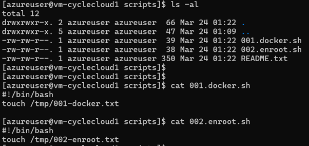
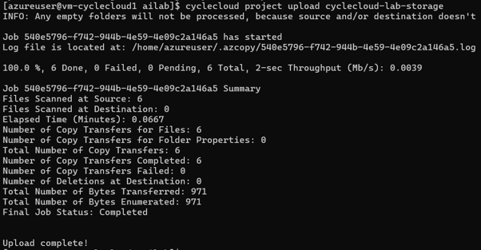

# Cluster-Init

CycleCloud에서 노드 기동 시 스크립트를 수행하는 방법은 cloud-init과 cluster-init 2가지가 있다.
cloud-init을 수정하면 전체 클러스터 재기동이 필요(CycleCloud 8.3 기준) 하여,
운영 중인 클러스터에 영향을 줄 수 있으므로, 특별한 이유가 없다면 cluster-init을 사용한다.

## 1. cloud-init vs cluster-init

| 항목         | cloud-init                | cluster-init                                 |
| ------------ | ------------------------- | -------------------------------------------- |
| 제공 주체    | Azure / VMSS              | CycleCloud 전용                              |
| 실행 시점    | VM 최초 부팅 시 1회       | CycleCloud가 노드를 구성할 때마다 (converge) |
| 설정 방식    | YAML (user-data)          | 셸 스크립트 + spec 디렉터리 구조             |
| 재실행       | 불가                      | `jetpack converge`로 재실행 가능           |
| 버전 관리    | 불가                      | CycleCloud 프로젝트 단위로 관리·배포        |
| 수정 시 영향 | 전체 클러스터 재기동 필요 | 개별 노드 단위 적용 가능                     |

운영 중인 클러스터에서 cloud-init을 수정한 뒤 노드를 추가하거나 재기동하면, 아래 오류가 발생하며 노드 할당이 실패한다.

```
This node does not match existing scaleset attribute: CloudInit
```

이를 해소하는 명령이 존재하지만, 기동 시 기존 cloud-init도 다시 적용되므로 근본적인 해결이 되지 않을 수 있다.

```bash
cycle_server fix_mismatched_attributes <클러스터명> --extra-attribute CloudInit
```

## 2. Cluster-Init 생성 및 업로드

cluster-init은 버전 관리가 되므로 GitHub에 관리하거나, CycleCloud 서버에서 직접 수행하는 것을 추천한다.

### 2.1. CycleCloud CLI 설치

아래 링크를 참고한다.

https://learn.microsoft.com/en-us/azure/cyclecloud/how-to/install-cyclecloud-cli?view=cyclecloud-8

설치 후 초기화:

```bash
cyclecloud initialize
```

### 2.2. 프로젝트 초기화

```bash
mkdir ~/cluster-init && cd ~/cluster-init
cyclecloud project init <프로젝트명>
```



생성되는 디렉터리 구조:

```
<프로젝트명>/
├── project.ini
├── specs/
│   └── default/
│       └── cluster-init/
│           ├── scripts/       # 실행할 셸 스크립트 (파일명 순서대로 실행)
│           ├── files/         # 배포할 파일
│           └── tests/       
```

### 2.3. 버전 관리

`project.ini` 파일에서 버전을 관리한다. 기존 프로젝트를 수정할 때는 버전을 올려서 배포한다.

```bash
vi <프로젝트명>/project.ini
```

예: `1.0.0` → `1.0.1`로 변경


### 2.4. 스크립트 작성

`specs/default/cluster-init/scripts/` 에 스크립트를 추가한다. 파일명 순서대로 실행되므로 `01-`, `02-` 등의 접두사를 붙이는 것을 추천한다.

```bash
# 예시, specs/default/cluster-init/scripts/01-install-packages.sh
#!/bin/bash
yum install -y htop tmux
```



### 2.5. 업로드

cluster-init은 locker로 지정된 Blob Storage에 업로드된다.

locker 이름 확인:

```bash
cyclecloud locker list
# 예: cyclecloud-lab-storage (az://storagecycle/cyclecloud)
```

UI에서도 확인 가능하다. 아래 화면의 ⑤ 항목을 참고한다.


업로드:

```bash
cd ~/cluster-init/<프로젝트명>
cyclecloud project upload <locker명>
```



### 2.6. 클러스터에 적용

CycleCloud > Slurm cluster > Edit > Advanced Settings > 원하는 파티션의 Browser
> 생성한 프로젝트  버전 > `default` 선택 후 Select


