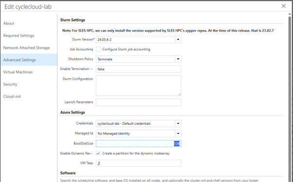
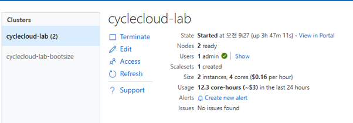
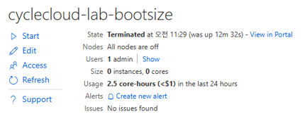
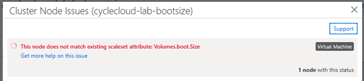
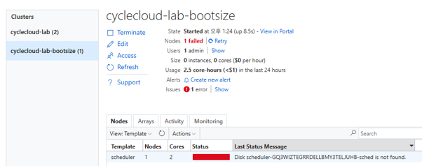
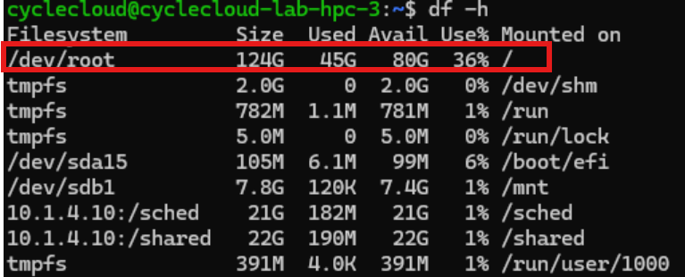
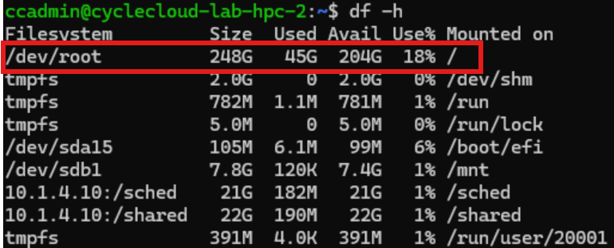

# CycleCloud HPC 노드 OS 디스크 사이즈 변경

CycleCloud 노드는 VMSS로 생성되며, 변경 반영 시 클러스터 재시작 또는 특정 노드 그룹 재할당 작업이 필요하다.


## 1. 클러스터 전체 반영노드 전체 재시작이 필요하다.

###### CycleCloud UI에서 BootDiskSize 변경

CycleCloud UI > Cluster 선택 > Edit > Advanced Settings > BootDiskSize 를 0에서 변경

(예: 128 → 128GB, Default는 0으로 실제로는 64GB로 생성됨)



###### 클러스터 Terminate 후 Start





> **주의**: 운영 중인 클러스터에서 UI로 bootDiskSize만 변경하고 재시작하지 않으면 문제가 발생한다.
>
> - 기존 HPC 노드는 정상이나, 새로 뜨는 HPC 노드는 동일 VMSS를 사용하면서 디스크 용량이 불일치하여 오류 발생
>
>   
> - 스케줄러 노드는 VM 기반이라 OS 디스크 사이즈 변경 이후 재시작 시 오류 발생
>
>   

## 2. 특정 파티션만 변경

특정 파티션의 OS 디스크 사이즈만 변경해야 할 경우 클러스터 전체 재시작 없이 해당 파티션의 노드 재할당 또는 새로 뜨는 노드에만 반영하는 방식이다.

###### VMSS 찾기

해당 파티션의 VMSS 이름을 확인 (방법 생략)

###### VMSS OS 디스크 사이즈 변경

```bash
az vmss update \
  -g <resource-group> \
  -n <VMSS-name> \
  --set "virtualMachineProfile.storageProfile.osDisk.diskSizeGb=256"
```

출력에서 `diskSizeGb` 값이 변경되었는지 확인

```json
"osDisk": {
  "caching": "None",
  "createOption": "FromImage",
  "diskSizeGb": 256,
  ...
}
```

###### 노드 재할당 시 자동 반영

변경 후 새로 생성되는 노드부터 적용된다.

hpc-3은 OS disk 128GB로 시작




az vmss update로 128 → 256GB로 변경 후, hpc-2 생성 및 확인



