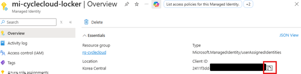
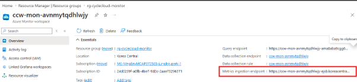
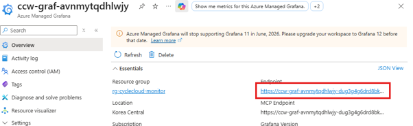
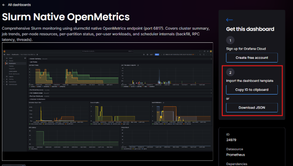
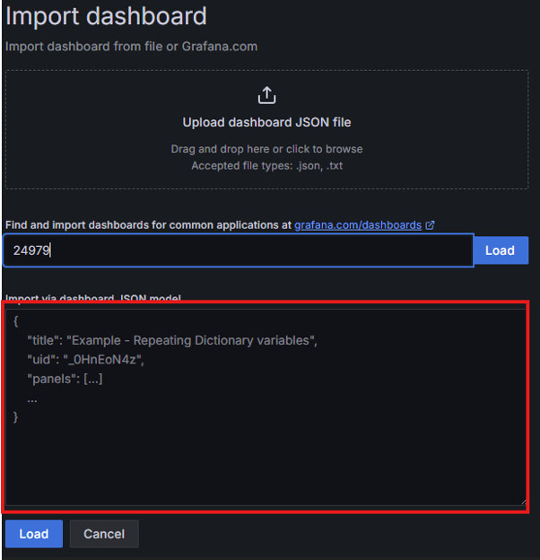
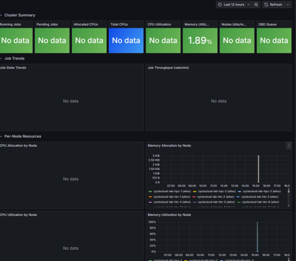
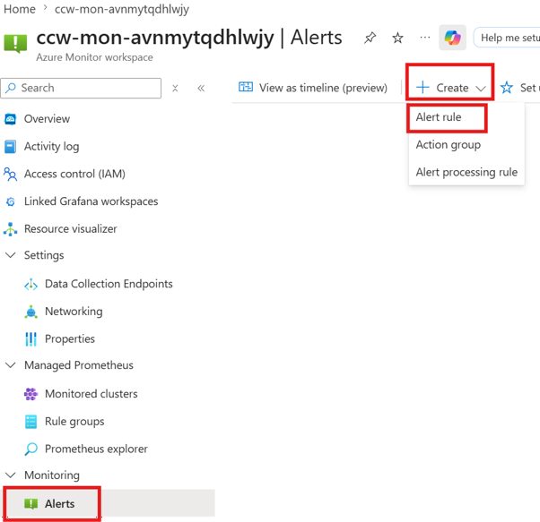
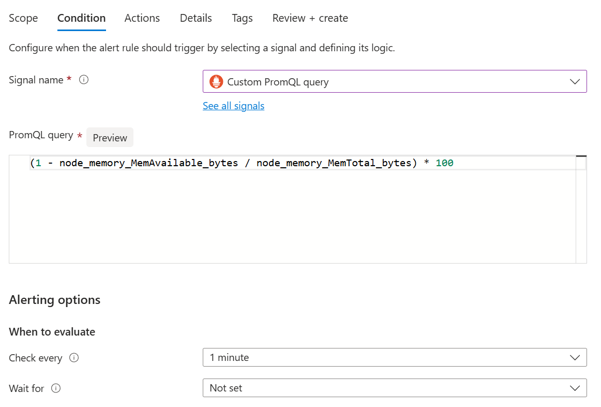
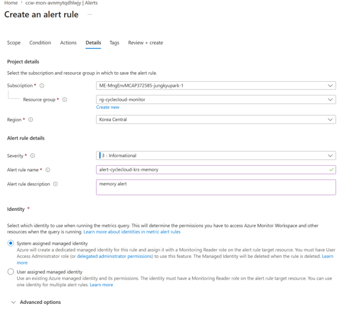
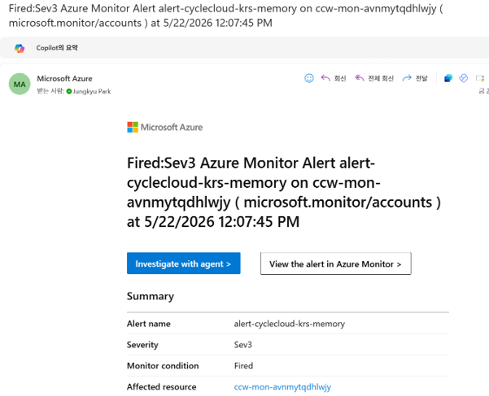

# CycleCloud GPU 모니터링

Azure CycleCloud 8.8.1 이상에서 Managed Prometheus + Managed Grafana를 활용한 GPU/CPU 모니터링 환경 구성

각 노드의 Exporter → 노드 Prometheus → Azure Managed Workspace(Prometheus) remote_write → Managed Grafana 시각화. 필요 시 Azure Managed Workspace Alert으로 임계치 알림을 받을 수 있다.


## 1. Azure Prometheus / Grafana 설치

[공식 문서](https://learn.microsoft.com/ko-kr/azure/cyclecloud/how-to/monitor-cyclecloud-cluster-using-prometheus-grafana?view=cyclecloud-8) 기반으로 작성했다.

###### Resource Group 생성

기존 Resource Group을 사용하거나, Prometheus/Grafana 전용 Resource Group을 생성한다.

> **참고**: 특정 리전 (예: Korea South)에서는 Managed Grafana를 지원하지 않는다.

###### 모니터링 인프라 구성

```bash
git clone https://github.com/Azure/cyclecloud-monitoring.git
cd cyclecloud-monitoring
./infra/deploy.sh <monitoring_resource_group>
```

###### Managed Identity에 권한 부여

Managed Identity를 새로 생성하거나,
CycleCloud Locker용 Managed Identity를 활용할 수도 있다.

확인 방법: CycleCloud GUI > Cluster > Edit > Advanced Settings > Azure Settings > Managed Ids

아래 빨간 박스의 앞 부분이 resource group, 뒷 부분이 managed identity name이다.


```bash
./infra/add_publisher.sh <umi_resource_group> <umi_name>
```

###### Managed Identity의 Client ID 가져오기

```bash
az identity show \
  --name <umi_name> \
  --resource-group <umi_resource_group> \
  --query 'clientId' --output tsv
```

Azure Portal에서도 확인할 수 있다.



###### Prometheus 엔드포인트 가져오기

모니터링 인프라를 생성하면 `outputs.json` 파일이 생성된다.

```bash
jq -r '.properties.outputs.ingestionEndpoint.value' <infra_monitoring_dir>/outputs.json
```

Azure Portal: Azure Managed Workspace > 생성된 Prometheus 선택 > Overview > Metrics ingestion endpoint



## 2. CycleCloud에서 모니터링 활성화

### 2.1. CycleCloud GUI에서 활성화

CycleCloud GUI에서 Exporter와 자체 Prometheus를 활성화할 수 있다.

클러스터가 이미 있다면 **재시작이 필요**하므로, 재시작이 어려운 경우 2-2 방법을 사용한다. 단, 이후 재시작을 대비하여 GUI에도 미리 반영해두는 것을 권장한다.

CycleCloud GUI > Cluster > Edit > Monitoring > Client ID와 Prometheus Ingestion Endpoint 입력


### 2.2. 수동으로 각 노드에 활성화

재시작 없이 운영 중인 노드에 모니터링을 적용하는 방법이다.

###### 스케줄러 노드에 적용

스케줄러 노드에서 아래 스크립트를 실행한다. `identity_client_id`와 `ingestion_endpoint`는 환경에 맞게 변경한다.

```bash
#!/bin/bash

# CycleCloud configuration에 모니터링 설정 추가
cat > /tmp/fix_monitoring_config.py << 'PYEOF'
import json

f = '/opt/cycle/jetpack/config/configuration.json'
with open(f) as fh:
    d = json.load(fh)

if 'cyclecloud' not in d:
    d['cyclecloud'] = {}
if 'monitoring' not in d['cyclecloud']:
    d['cyclecloud']['monitoring'] = {}

d['cyclecloud']['monitoring']['enabled'] = True
d['cyclecloud']['monitoring']['identity_client_id'] = '<CLIENT_ID>'
d['cyclecloud']['monitoring']['ingestion_endpoint'] = '<INGESTION_ENDPOINT>'

with open(f, 'w') as fh:
    json.dump(d, fh, indent=2)

print('config updated on ' + __import__('socket').gethostname())
PYEOF

sudo chmod u+w /opt/cycle/jetpack/config/configuration.json
sudo python3 /tmp/fix_monitoring_config.py
sudo bash /mnt/cluster-init/monitoring/default/scripts/00_prometheus.sh
sudo bash /mnt/cluster-init/monitoring/default/scripts/10_node_exporter.sh

echo "$(hostname): prometheus=$(sudo systemctl is-active prometheus), node_exporter=$(sudo systemctl is-active node_exporter)"
```

확인:

```bash
curl -s http://localhost:9100/metrics | head -5
# 메트릭이 출력되면 정상
```

###### HPC 노드에 적용

Slurm Job으로 배포한다. 테스트로 1개 노드에 먼저 적용 후 전체 HPC 노드에 적용하는 것을 권장한다.

```bash
cat << 'EOF' > ~/install_monitoring_job.sh
#!/bin/bash
#SBATCH -J install-mon
#SBATCH -N 1
#SBATCH --ntasks-per-node=1
#SBATCH -o monitoring_%j.log

sudo -i bash << 'ROOTEOF'
chmod u+w /opt/cycle/jetpack/config/configuration.json

cat > /tmp/fix_monitoring_config.py << 'PYEOF'
import json

f = '/opt/cycle/jetpack/config/configuration.json'
with open(f) as fh:
    d = json.load(fh)

if 'cyclecloud' not in d:
    d['cyclecloud'] = {}
if 'monitoring' not in d['cyclecloud']:
    d['cyclecloud']['monitoring'] = {}

d['cyclecloud']['monitoring']['enabled'] = True
d['cyclecloud']['monitoring']['identity_client_id'] = '<CLIENT_ID>'
d['cyclecloud']['monitoring']['ingestion_endpoint'] = '<INGESTION_ENDPOINT>'

with open(f, 'w') as fh:
    json.dump(d, fh, indent=2)

print('config updated on ' + __import__('socket').gethostname())
PYEOF

python3 /tmp/fix_monitoring_config.py
jetpack config cyclecloud.monitoring.enabled
bash /mnt/cluster-init/monitoring/default/scripts/00_prometheus.sh
bash /mnt/cluster-init/monitoring/default/scripts/10_node_exporter.sh

echo "$(hostname): prometheus=$(systemctl is-active prometheus), node_exporter=$(systemctl is-active node_exporter)"
ROOTEOF

# 1개 노드에 테스트
sbatch install_monitoring_job.sh

# squeue로 수행중인 노드 확인
# 이후 정상 여부 확인
ssh <노드> 'curl -s http://localhost:9100/metrics | head -5'
```

아래처럼 나오면 정상, 아무 값도 안나오면 확인 필요


## 3. 모니터링 확인

###### CycleCloud 기본 Dashboard

Azure Portal > Azure Managed Grafana > 생성된 Grafana > Overview > Endpoint 확인



웹 브라우저에서 Grafana Endpoint로 접속 후, Dashboards > Azure CycleCloud 항목을 확인한다.


###### Community Dashboard

외부 사용자가 공유한 대시보드를 가져올 수 있다. 단, Grafana 버전에 따라 정상 동작하지 않을 수 있으므로 Copilot의 도움을 받아 직접 구성하는 것도 권장한다.

[https://grafana.com/grafana/dashboards/](https://grafana.com/grafana/dashboards/) 에서 "Slurm"으로 검색하면 몇 가지 대시보드를 찾을 수 있다.

ID를 복사하거나 (예: 24979) JSON을 다운로드한다. Outbound가 열려있으면 ID로 가져올 수 있고, 막혀있으면 JSON 파일을 사용해야 한다.



Azure Managed Grafana > Dashboard > 우측 상단 New > Import 클릭


다운로드한 JSON 파일을 붙여넣고 Load 클릭



Prometheus 부분만 새로 생성한 Managed Prometheus를 선택하고 Import 클릭


대시보드에 접속하여 정상적으로 출력되는지 확인한다.



## 4. 알림

임계치 초과 시 알림을 받을 수 있다. PromQL Query로 자유롭게 조건을 설정할 수 있다.

###### PromQL Query 테스트

알람 조건으로 설정할 PromQL Query를 Grafana에서 먼저 테스트한다.

Grafana > Explorer > Query > 우측 Code > Metrics browser에 PromQL Query 입력 > 우측 상단 Run Query 클릭


###### 알림 규칙 생성

Azure Managed Workspace > Alert > Create > Alert rule



Condition > 원하는 알람 조건 입력 > Check every: 주기 설정



Actions > Action group과 Actions 선택


Details에서 Alert rule name과 description 입력 후 저장



임계치 초과 시 아래와 같이 경고 메일을 받을 수 있다.


