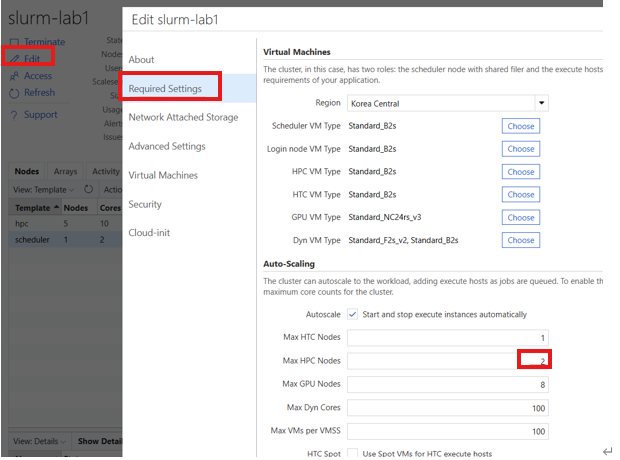
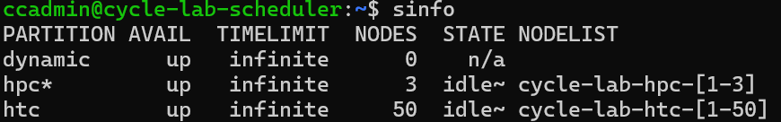

# Node Scaling

CycleCloud Slurm 클러스터에서 HPC 노드의 수량을 조절

## 1. Scale-in 방지

- Slurm은 필요할 때만 자원을 할당하고, 사용하지 않으면 자동 회수하여 비용 효율적으로 운영할 수 있다.
- 하지만 Reserved Instance 계약이 포함되어 Scale-in이 불필요한 경우에는 자동 축소를 방지해야 한다.
- 기본적으로 Suspend time이 300초라 노드에 Job이 할당되지 않으면 5분내에 Scale in 된다.
- CycleCloud UI의 `keep_alive` 옵션은 정상적으로 작동하지 않는다. (2025년 9월 기준)

파티션별 Scale-in 제외 설정: `/etc/slurm/slurm.conf`

```ini
SuspendExcParts=hpc   # hpc 파티션의 노드를 자동 축소 대상에서 제외
```

적용

```bash
sudo scontrol reconfigure
```

## 2. 파티션별 최대 수량 조정

- 이미 동작 중인 클러스터에선 UI에서 조정해도 반영되지 않는다. 하지만 나중에 있을 재시작을 고려하여 둘 다 반영하는 것을 권장한다.
- Cyclecloud 8.6 이전에는 count 값이 Core 수 기준이었으나 8.7+부턴 인스턴스 수 기준이다.
- 노드 증설은 아래 수량 조정 후 진행하고, 노드 감설은 수량 조정 후 아래 내용을 진행한다.

###### CycleCloud UI에서 수량 조정

클러스터 > Edit > Required Settings > Auto-Scaling 에서 조정 후 Save



###### 스케줄러 노드에서 수량 조정

1) 스케줄러 노드에 SSH 접속

2) `azure.conf` 파일 수정

```bash
sudo vi /sched/slurm-lab1/azure.conf
```

수정을 원하는 파티션 노드 범위를 원하는 수량으로 변경한다. 예: `[1-2]` → `[1-3]`으로 변경 (최대 2대 → 3대)

> PartitionName=hpc Nodes=slurm-lab1-hpc-**[1-2]** Default=YES DefMemPerCPU=1536 MaxTime=INFINITE State=UP
> Nodename=slurm-lab1-hpc-**[1-2]** Feature=cloud STATE=CLOUD CPUs=2 ThreadsPerCore=1 RealMemory=3072

3) 설정 반영

```bash
sudo scontrol reconfigure
```


## 3. 노드 할당 및 회수

`azslurm` 명령어로 노드를 할당 및 회수할 수 있다.

현재 상태 확인:

```bash
sinfo
```



노드 할당:

```bash
sudo -i
azslurm resume --node-list cyclecloud-lab-hpc-1
```

노드 회수 (삭제):

```bash
azslurm suspend --node-list cyclecloud-lab-hpc-1
```
