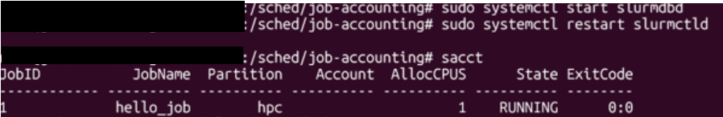

# Slurm Job Accounting on Azure CycleCloud

Azure CycleCloud의 Slurm 클러스터에서 Job Accounting(`sacct`)을 활성화

## Why Job Accounting?

- Slurm은 기본적으로 Job 기록을 메모리에만 보관하므로, 스케줄러 재시작 시 이력이 소실된다.
- Job Accounting을 활성화하면 누가, 언제, 어떤 리소스(CPU/GPU/메모리)를 얼마나 사용했는지 영구적으로 추적할 수 있다.
- 이 데이터를 기반으로 사용자/프로젝트별 비용 배분(chargeback)과 클러스터 용량 계획이 가능해진다.
- `sacct`, `sreport` 등의 명령으로 Job 효율(대기 시간, 실행 시간, 리소스 낭비)을 분석하여 운영을 최적화할 수 있다.
- 별도의 Database (ex: Azure Database for MySQL - Flexible Server)

---

## 1. Azure Database for MySQL 생성

| 항목       | 설정                                                               |
| ---------- | ------------------------------------------------------------------ |
| VNet       | CycleCloud와 동일한 VNet                                           |
| Subnet     | 별도의 Private Subnet 생성                                         |
| Networking | **Private access** 선택 → 위에서 생성한 Private Subnet 연결 |

## 2. CycleCloud UI에서 클러스터 생성 시 설정

Cyclecloud UI에서 Job Accounting을 활성화하는 방법이며, 이미 생성된 클러스터의 경우 클러스터 재시작이 필요하다.
클러스터 재시작이 어려운 경우 아래 방법 B를 활용하되, 재시작을 고려하여 UI에도 적용해둔다.

Cyclecloud UI > Cluster > (이미 생성된 경우) Edit > Advanced Settings > Slurm Settings > Job Accounting 선택> 정보 입력


클러스터 생성 후 `sacct` 명령으로 정상 동작을 확인한다.


**참고**: [Setting up Slurm Job Accounting with Azure CycleCloud and Azure Database for MySQL](https://techcommunity.microsoft.com/blog/azurehighperformancecomputingblog/setting-up-slurm-job-accounting-with-azure-cyclecloud-and-azure-database-for-mys/4083685)

## 3. 운영 중인 클러스터에 Job Accounting 설정

이미 Job Accounting 없이 생성된 클러스터에 재시작 없이 적용하는 방법이다.

스케줄러 노드에 ssh로 접속한 후 sudo 로 수행한다.

#### 3-1. 설정 파일 변경: `/etc/slurm/accounting.conf`

```ini
AccountingStorageType=accounting_storage/slurmdbd
AccountingStorageHost=<cluster-name>-scheduler
AccountingStorageTRES=gres/gpu
```

#### 3-2. 설정 파일 추가: `/etc/slurm/slurmdbd.conf`

```ini
#
# See the slurmdbd.conf man page for more information.
#

# Archive info
#ArchiveJobs=yes
#ArchiveDir="/tmp"
#ArchiveSteps=yes
#ArchiveScript=
#JobPurge=12
#StepPurge=1

# Authentication info
AuthType=auth/munge

# slurmDBD info
DbdAddr=localhost
DbdHost=<cluster-name>-scheduler  # <- 변경
SlurmUser=slurm
DebugLevel=verbose
LogFile=/var/log/slurmctld/slurmdbd.log
PidFile=/var/run/slurmdbd.pid

# Database info
StorageType=accounting_storage/mysql
StorageHost=<MySQL DNS>  # ex: cc-mysql-db.mysql.database.azure.com
StorageLoc=sacct
StoragePass=<MySQL PW>   # <- 변경
StorageUser=<MySQL User> # <- 변경
StorageParameters=SSL_CA=/etc/slurm/AzureCA.pem
```

#### 3-3. SSL 인증서 추가: `/etc/slurm/AzureCA.pem`

```bash
wget https://cacerts.digicert.com/DigiCertGlobalRootG2.crt.pem -O /etc/slurm/AzureCA.pem
```

#### 3-4. 파일 권한 설정

```bash
chown slurm:slurm /etc/slurm/slurmdbd.conf
chmod 600 /etc/slurm/slurmdbd.conf
```

#### 3-5. 프로세스 시작 및 재시작

```bash
systemctl start slurmdbd
systemctl restart slurmctld
```

---

## 4. 확인

```bash
sacct
```

정상적으로 Job Accounting이 활성화되었으면 이전 Job 기록이 출력된다.


