# Cyclecloud User management

cyclecloud에선 사용자를 built in, Active directory, LDAP, Entra ID로 관리할 수 있다.

여기서는 Built-in 을 안내한다.

###### Cyclecloud GUI 접속 및 User Setting

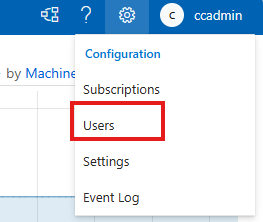

###### Users 탭에서 Create

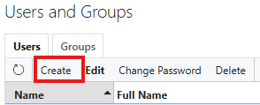User 추가

Roles: 해당 User가 Cyclecloud GUI 에 접근할 필요가 없다면 아무것도 체크 안해도 된다.

Node Settings: Keypair (pem 파일) 기반으로 노드에 접속하려면 등록이 필요하다.

 

###### Groups

노드 OS 상의 Group이 아닌 Cyclecloud Cluster 의 Groups을 의미한다.

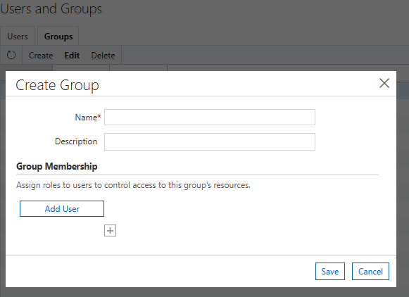

###### Cluster에 Users 추가

내부에서 jetpack 데몬이 동작하여 GUI에서 사용자 등록하면 바로 적용된다.

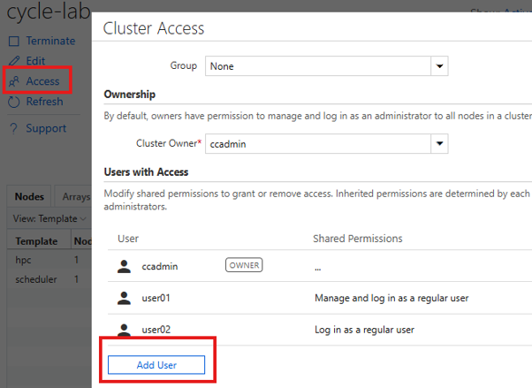

노드에 pem 파일로 접속이 가능하다.

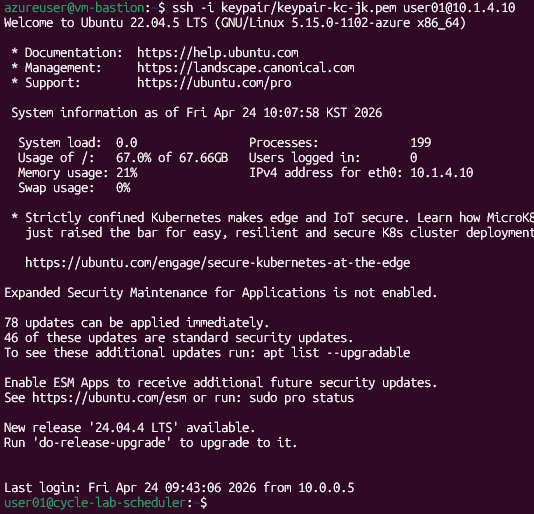

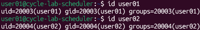

###### User에 sudo 권한 부여

Configuration > Users > Edit > 변경할 User 선택 및 Group Node Admin 선택


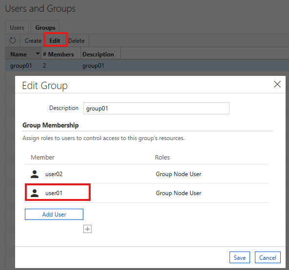

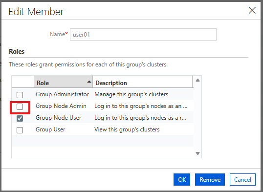

Cluster > Access > Group 변경

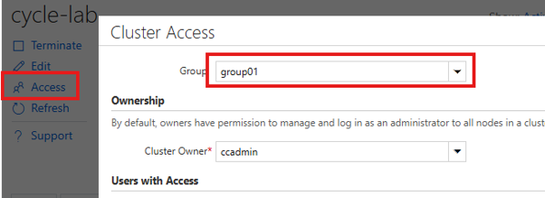

약간의 시간이 지나면 자동으로 반영된다.

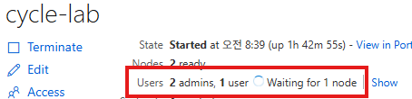

SSH 접속 시 Secondary Group이 cyclecloud로 추가된다.

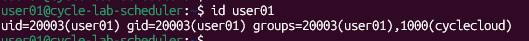

sudo 권한을 사용할 수 있다.

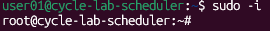

권한 회수도 CycleCloud GUI에서 진행하며, Configuration > User 또는 Group에서 변경하면 자동 반영된다.

###### 스케줄러 노드에 Password로 SSH 접속

###### 1) Node Admin 사용자 비밀번호 변경

Keypair 또는 Azure Portal > VM > Password 초기화

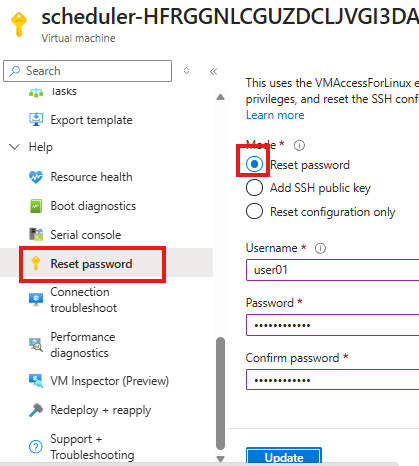

이 작업을 하지 않으면 Password 기반 SSH 접속이 불가하다. Azure Portal에서 비밀번호를 변경하거나 OS에서 Password 접속을 허용해야 한다.

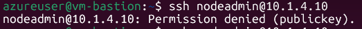

###### 2) nodeadmin으로 스케줄러 노드에 접속 및 사용자 비밀번호 등록

```bash
# users.txt 생성
cat > users.txt << EOF
nodeadmin:비밀번호
nodeuser:비밀번호
EOF

# 비밀번호 반영
sudo chpasswd < users.txt
```

- Node Admin인 nodeadmin User는 su 접근 가능

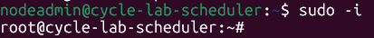

- Node User인 nodeuser User는 su 접근 불가

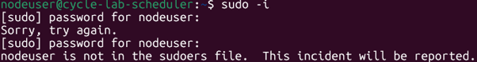
